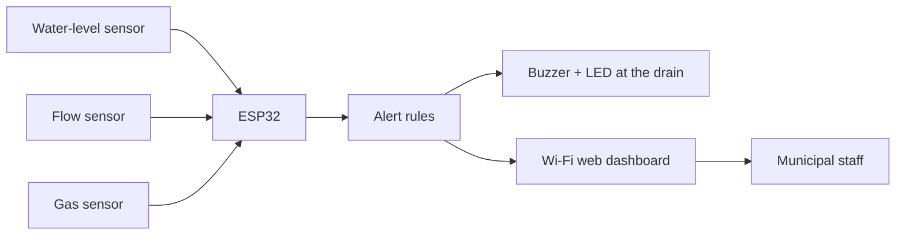

# Technical Design Document

**Project:** Smart Drain Safety & Early-Warning System
**Author:** KAMALRAJ G (individual participant), PSNA College of Engineering and Technology, Dindigul
**Event:** Hack for Social Cause – Youth Tech Challenge 2027 (Theme: Governance & Civic Technology)

## 1. Problem

Underground drains are often inspected manually and only after a blockage or flood. Residents face waterlogging and health risks, sanitation workers can be exposed to toxic gases, and authorities have no real-time data to plan cleaning.

## 2. Solution overview

An ESP32 node installed at a drain reads three sensors (water level, flow rate, gas indicator). It evaluates simple threshold rules, drives a local buzzer and LED, and serves a live dashboard over Wi-Fi for municipal staff.

## 3. Architecture



| Layer | Component | Role |
|---|---|---|
| Sensing | Water-level, flow-rate, gas sensors | Measure drain conditions |
| Processing | ESP32 microcontroller | Samples every second, evaluates rules |
| Alerting | Buzzer and LED | Local warning for people near the drain |
| Application | Embedded web server (`/` page, `/data` JSON) | Live view for staff |

## 4. Alert rules (priority order)

1. **GAS_ALERT**: gas reading at or above `GAS_ALERT_RAW`.
2. **OVERFLOW_ALERT**: water level at or above `LEVEL_ALERT_PCT`.
3. **BLOCKAGE_WARNING**: water level at or above `LEVEL_WARN_PCT` while flow is at or below `FLOW_LOW_LPM` (water is high but not moving).
4. **NORMAL**: none of the above.

Default thresholds are in `firmware/smart_drain/config.h` and must be calibrated for the real sensors and drain.

## 5. Data interface

`GET /data` returns JSON:

```json
{"level_pct": 63.0, "flow_lpm": 0.80, "gas_raw": 520, "status": "BLOCKAGE_WARNING"}
```

## 6. Testing

`tests/threshold_logic.py` mirrors the firmware rules; `tests/test_thresholds.py` checks each rule, the boundary values, and every row of `data/sample_readings.csv`. Hardware testing (sensor calibration, alert behaviour in a real drain model) must be done on the physical prototype.

## 7. Limitations and future scope

- Thresholds are fixed and need on-site calibration.
- The gas sensor gives a raw indicator, not a certified gas concentration, so it is a warning aid and not a replacement for approved safety equipment.
- Planned extensions: SMS alerts, GIS-based drain mapping, data logging for cleaning schedules.

## 8. SDG alignment

SDG 11 (Sustainable Cities and Communities), SDG 6 (Clean Water and Sanitation), SDG 3 (Good Health and Well-being), SDG 9 (Industry, Innovation and Infrastructure).
